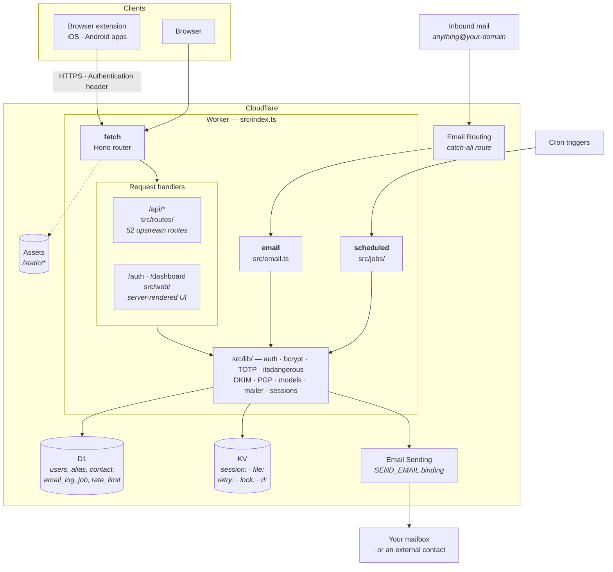
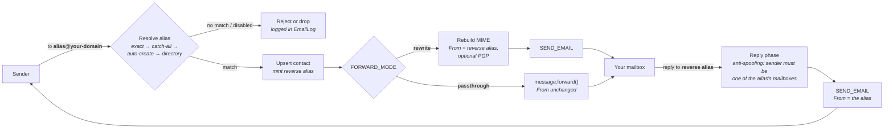

# SimpleLogin on Cloudflare Workers

A ground-up reimplementation of [SimpleLogin](https://github.com/simple-login/app)
— the open-source email-alias service — for the Cloudflare stack: Workers +
D1 + KV + Email Routing/Sending. No servers, no Postgres, no Postfix, no
Redis.

The HTTP API is **field-exact and status-code-exact** with upstream, so the
official SimpleLogin clients — browser extension, iOS and Android apps —
work against a deployment of this by changing only the API URL.

> **Status:** feature-complete and in production use by the author. 964 tests
> run in real `workerd`. It is not affiliated with SimpleLogin or Proton AG.

## What works

- **Aliases** — random and custom, on shared or your own custom domains,
  with catch-all and auto-create rules, directories, subdomains, notes,
  mailbox assignment, activity log, trash/restore.
- **Email forwarding and replying** — inbound mail to an alias is rewritten
  and forwarded to your real mailbox; replying to the reverse-alias address
  reaches the original sender with your address never exposed. Includes
  bounce (DSN) handling, transient-send retry with backoff, loop and flood
  guards, and PGP encryption to your mailbox key.
- **The dashboard** — the full server-rendered UI: aliases, mailboxes,
  domains, contacts, settings, 2FA (TOTP + recovery codes), data export,
  alias CSV import, account deletion.
- **The API** — all 52 upstream routes, so existing clients keep working.
- **One-click domain setup** — point a Cloudflare-hosted domain at your
  instance from the dashboard: it enables Email Routing, sets the catch-all
  route, and writes the verification and DMARC records. See
  [`docs/DOMAINS.md`](docs/DOMAINS.md).

## Architecture

One Worker script with three entry points, four bindings, and no servers of
any kind. Everything below runs inside Cloudflare.



### The mail path

This is where the platform shapes the design most, so it is worth reading
before changing `src/email.ts`.



Two Cloudflare constraints drive the odd bits:

- **The `send_email` binding requires the envelope sender to equal the `From`
  header.** So there is no VERP bounce address. Bounces arrive as ordinary
  inbound mail and are attributed by parsing the DSN for the original
  message's `EmailLog` id.
- **`message.forward()` can only add `X-*` headers** — it cannot rewrite
  `From`/`To`. Full parity therefore means rebuilding the message and sending
  it through the binding, which only passes strict-receiver DMARC once the
  domain is onboarded onto Email Sending. That is the `FORWARD_MODE` branch
  above, and why `passthrough` exists as a free-tier fallback.

A per-minute cron drains a D1 `job` table (alias CSV import, mailbox/domain/
account deletion, onboarding mail, and send retries with backoff); a daily one
purges trashed aliases and trims the rate-limit, notification and job tables.

## What is deliberately different

The platform forces some divergence, and it is worth understanding before
relying on this. The full list is in [`HANDOVER.md`](HANDOVER.md); the
headline items:

- **Envelope sender must equal the `From` header.** Cloudflare's `send_email`
  binding requires this, so there is no VERP bounce address. Bounces come
  back as ordinary inbound mail and are attributed by parsing the DSN.
- **Full-parity forwarding needs Email Sending onboarded** for your domain,
  otherwise strict receivers reject the rewritten `From`. A `FORWARD_MODE`
  var selects `rewrite` (parity) or `passthrough` (free-tier fallback).
- **Forwarding reaches only verified destination addresses** unless the
  domain is onboarded onto Email Sending — Cloudflare refuses sends to
  unverified destinations.
- Sessions are opaque KV tokens rather than signed cookies; Redis limits and
  locks became a D1 table with the same key semantics; SpamAssassin scoring,
  the Flask-Admin panel, and Paddle/Proton partner flows are not ported.
- No billing backend. Lifting the free-tier limits on a self-hosted instance
  is a one-line `UPDATE users SET lifetime = 1`.

## Requirements

- A Cloudflare account with **Workers Paid** if you want `FORWARD_MODE=rewrite`
  (it enables Email Sending). The free tier works in `passthrough` mode.
- A domain **whose DNS is on Cloudflare, in the same account as the worker** —
  Email Routing can only deliver to a Worker in its own account.
- Node 22+.

## Setup

```sh
npm ci
cp wrangler.example.jsonc wrangler.jsonc     # then fill in the TODOs
```

1. **Create the resources** and put the returned ids into `wrangler.jsonc`:

   ```sh
   npx wrangler d1 create simplelogin
   npx wrangler kv namespace create SESSIONS
   npx wrangler d1 migrations apply simplelogin --remote
   ```

2. **Set the signing secret.** Reuse an existing Flask deployment's
   `FLASK_SECRET` to keep its signed URLs and password hashes valid:

   ```sh
   npx wrangler secret put FLASK_SECRET
   ```

3. **Configure `wrangler.jsonc`** — at minimum `EMAIL_DOMAIN`,
   `ALIAS_DOMAINS` and `URL`. Every var is documented in
   `wrangler.example.jsonc`. Note the presence-based flags
   (`DISABLE_REGISTRATION`, `DISABLE_RATE_LIMIT`, …): setting them to *any*
   value, including `"0"`, turns them **on**, matching upstream's config
   semantics. Leave `DISABLE_REGISTRATION` set unless you want the world to
   be able to sign up.

4. **Enable Email Routing** on the zone of `EMAIL_DOMAIN` and add a catch-all
   rule → *Send to a Worker* → this worker. For full-parity forwarding, also
   onboard the domain onto **Email Sending** (dashboard: Compute → Email
   Service → Email Sending). [`docs/DOMAINS.md`](docs/DOMAINS.md) covers
   this, including the `scripts/provision-domain.mjs` helper.

5. **Deploy:**

   ```sh
   npm run deploy
   ```

6. Register your account, then close signups and lift your own limits:

   ```sh
   npx wrangler d1 execute simplelogin --remote \
     --command "UPDATE users SET lifetime = 1;"
   ```

## Development

```sh
npm test           # vitest in real workerd with D1 + KV
npm run typecheck
npx @biomejs/biome check .
npm run build:assets   # also fails the build on any static asset that would 404
```

The compatibility contract lives in [`specs/`](specs/) — documents extracted
route-by-route from the upstream Flask source, covering all 52 API routes,
the data model, the email pipeline and config quirks. Paths cited there are
relative to <https://github.com/simple-login/app>; clone it alongside to
follow along. `HANDOVER.md` is the architecture companion.

| Path | What |
|---|---|
| `src/index.ts` | Worker entry: Hono app (`fetch`), Email Routing handler (`email`), cron (`scheduled`) |
| `src/routes/` | The API route groups |
| `src/web/` | The server-rendered dashboard |
| `src/email.ts` | Forward + reply pipeline |
| `src/jobs/` | Cron-driven job runner (import, deletions, onboarding, retries) |
| `src/lib/` | Auth, crypto (bcrypt/TOTP/itsdangerous), models, DKIM, PGP, mailer, sessions |
| `migrations/` | D1 schema |
| `specs/` · `docs/` | Compatibility contract · operator guides |

## Licence

[GNU AGPL v3.0](LICENSE), as a derivative work of SimpleLogin. If you run a
modified version as a network service, the AGPL requires you to offer its
source to users of that service. See [NOTICE](NOTICE) for attribution.
